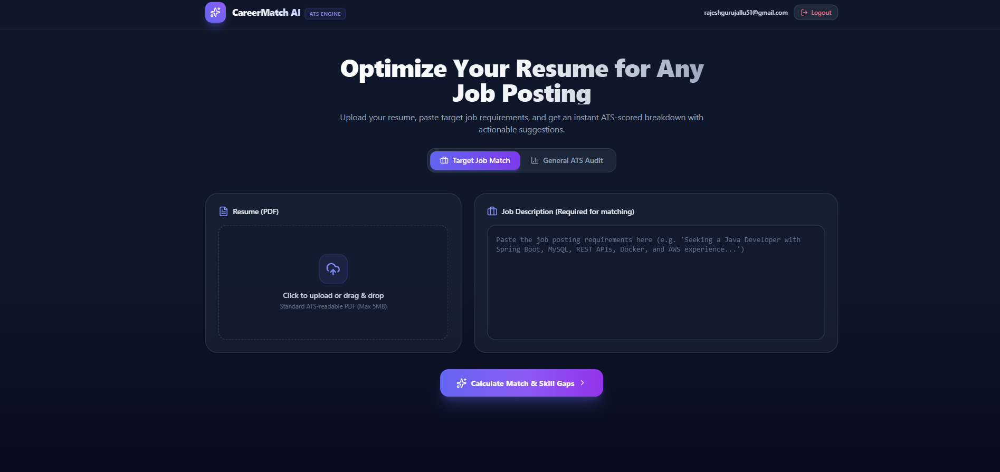
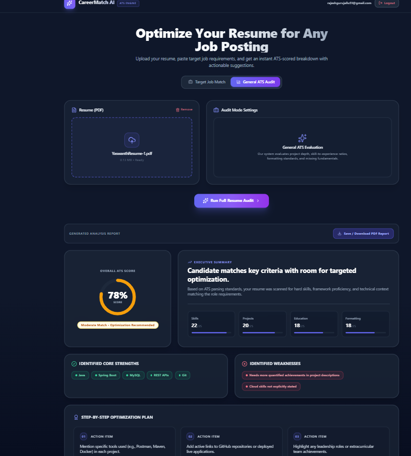

# 🚀 AI-Powered Resume Analyzer & Job Match Assistant

An intelligent full-stack ATS (Applicant Tracking System) simulator and career assistant. It allows job seekers to parse their resumes, evaluate ATS readiness, and compare their qualifications against specific job descriptions using real-time generative AI.

## 📸 Screenshots

### Dashboard


### Job Match Analysis


### General ATS Audit


## 📌 Problem Statement

Over 75% of resumes are filtered out by automated Applicant Tracking Systems (ATS) before a human recruiter ever sees them. Most candidates are rejected because of:

- Missing critical industry keywords and framework proficiencies.
- Lack of quantifiable achievements in project descriptions.
- Mismatched alignment with target job descriptions.

This application eliminates the guesswork by providing data-driven match scores, missing keyword detection, and customized optimization advice.

## ✨ Core Features

### 1. 🎯 Target Job Match Analysis (Flagship Feature)
- Upload any **PDF resume** and paste a target **Job Description**.
- Calculates an instant **Match Compatibility Score (%)**.
- Highlights **Matched Keywords** vs. **Missing Skills**.
- Provides a prioritized, step-by-step optimization plan.

### 2. 📊 General ATS Resume Audit
- Evaluates resume structure, depth, and clarity without a job description.
- Breaks down scoring into:
  - Technical Skills Score
  - Projects & Impact Score
  - Education & Credentials Score
  - Formatting & Readability Score

### 3. 🔐 User Authentication & Persistence
- User Registration and Login protected by **JWT (JSON Web Tokens)**.
- Passwords safely hashed using **BCrypt**.
- Auto-configured relational schema with **Spring Data JPA** and **MySQL**.

### 4. 🖨️ One-Click PDF Report Export
- Generates an ATS diagnostic report that users can print or save directly as a PDF.

### 5. 🛡️ Resilient Architecture (Smart Fallback Engine)
- Zero-crash fallback algorithm ensures 100% platform availability even during cloud AI traffic spikes or outages.

## 🛠️ Tech Stack

| Layer | Technology | Purpose |
| :--- | :--- | :--- |
| **Frontend** | React.js | Dynamic, reactive user dashboard |
| **Styling** | Tailwind CSS & Lucide Icons | Responsive, modern dark-mode SaaS UI |
| **Backend** | Java 17, Spring Boot 3 | High-throughput REST API server |
| **Security** | Spring Security, JWT, BCrypt | Token-based stateless authentication |
| **Database** | MySQL, Hibernate / JPA | Relational user and credential persistence |
| **PDF Extraction** | Apache PDFBox | High-performance text parsing from PDF documents |
| **AI Engine** | Google Gemini / Groq Llama 3 | Real-time semantic analysis & keyword extraction |

## 🏛️ System Architecture

```text
[ React + Tailwind CSS Dashboard ]
                │
         (HTTP Multipart)
                ▼
   [ Spring Boot REST Controller ]
    ├── Spring Security (JWT / BCrypt) ──> [ MySQL Database ]
    ├── Apache PDFBox (Text Extractor)
    └── AI Service (Semantic Engine) ───> [ LLM: Gemini / Llama 3 ]
```

## 🚀 Getting Started Locally

### Prerequisites
- Java 17+ installed (`java -version`)
- Node.js & npm installed (`node -v`)
- MySQL Server running locally

### 1. Backend Setup (Spring Boot)

Navigate to the demo directory:

```bash
cd demo
```

Configure your MySQL credentials and AI key in `src/main/resources/application.properties`:

```properties
spring.datasource.url=jdbc:mysql://localhost:3306/resume_analyzer_db?useSSL=false&allowPublicKeyRetrieval=true&serverTimezone=UTC
spring.datasource.username=root
spring.datasource.password=YOUR_MYSQL_PASSWORD

gemini.api.key=YOUR_API_KEY
```

Run the backend server:

```bash
# On Windows
.\mvnw spring-boot:run

# On Linux/macOS
./mvnw spring-boot:run
```

Backend will be active at `http://localhost:8080`.

### 2. Frontend Setup (React)

Open a new terminal and navigate to the frontend directory:

```bash
cd frontend
```

Install dependencies:

```bash
npm install
```

Start the React development server:

```bash
npm start
```

Frontend will launch at `http://localhost:3000`.
